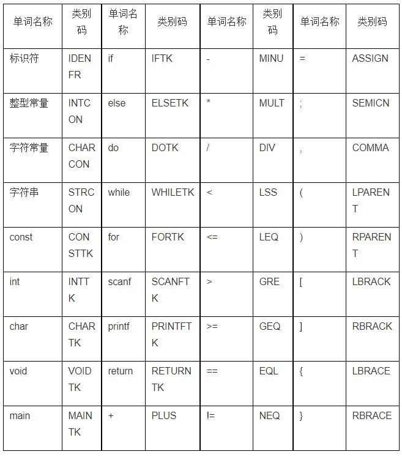

# 词法分析
【问题描述】

请根据给定的文法设计并实现词法分析程序，从源程序中识别出单词，记录其单词类别和单词值，输入输出及处理要求如下：

   （1）数据结构和与语法分析程序的接口请自行定义；类别码需按下表格式统一定义；

   （2）为了方便进行自动评测，输入的被编译源文件统一命名为testfile.txt；输出的结果文件统一命名为output.txt，结果文件中每行按如下方式组织：

单词类别码 单词的字符/字符串形式(中间仅用一个空格间隔)

单词的类别码请统一按如下形式定义：

```
【输入形式】testfile.txt中的符合文法要求的测试程序。
【输出形式】要求将词法分析结果输出至output.txt中。
【样例输入】

const int const1 = 1, const2 = -100;
const char const3 = '_';
int change1;
char change3;
int gets1(int var1,int var2){
    change1 = var1 + var2;
    return (change1);
}
void main(){
    printf("Hello World");
    printf(gets1(10, 20));
}
【样例输出】

CONSTTK const
INTTK int
IDENFR const1
ASSIGN =
INTCON 1
COMMA ,
IDENFR const2
ASSIGN =
MINU -
INTCON 100
SEMICN ;
CONSTTK const
CHARTK char
IDENFR const3
ASSIGN =
CHARCON _
SEMICN ;
INTTK int
IDENFR change1
SEMICN ;
CHARTK char
IDENFR change3
SEMICN ;
INTTK int
IDENFR gets1
LPARENT (
INTTK int
IDENFR var1
COMMA ,
INTTK int
IDENFR var2
RPARENT )
LBRACE {
IDENFR change1
ASSIGN =
IDENFR var1
PLUS +
IDENFR var2
SEMICN ;
RETURNTK return
LPARENT (
IDENFR change1
RPARENT )
SEMICN ;
RBRACE }
VOIDTK void
MAINTK main
LPARENT (
RPARENT )
LBRACE {
PRINTFTK printf
LPARENT (
STRCON Hello World
RPARENT )
SEMICN ;
PRINTFTK printf
LPARENT (
IDENFR gets1
LPARENT (
INTCON 10
COMMA ,
INTCON 20
RPARENT )
RPARENT )
SEMICN ;
RBRACE }
```
[AC代码](lexical.cc)

# 语法分析
```
【问题描述】

请根据给定的文法设计并实现语法分析程序，能基于上次作业的词法分析程序所识别出的单词，识别出各类语法成分。输入输出及处理要求如下：

（1）需按文法规则，用递归子程序法对文法中定义的所有种语法成分进行分析；

（2）为了方便进行自动评测，输入的被编译源文件统一命名为testfile.txt；输出的结果文件统一命名为output.txt ；结果文件中包含如下两种信息：

    1）按词法分析识别单词的顺序，按行输出每个单词的信息（要求同词法分析作业，对于预读的情况不能输出）。

    2）在下列高亮显示的语法分析成分分析结束前，另起一行输出当前语法成分的名字，形如“<常量说明>”（注：未要求输出的语法成分仍需要分析）

＜加法运算符＞ ::= +｜-
＜乘法运算符＞  ::= *｜/
＜关系运算符＞  ::=  <｜<=｜>｜>=｜!=｜==
＜字母＞   ::= ＿｜a｜．．．｜z｜A｜．．．｜Z

＜数字＞   ::= ０｜＜非零数字＞
＜非零数字＞  ::= １｜．．．｜９
＜字符＞    ::=  '＜加法运算符＞'｜'＜乘法运算符＞'｜'＜字母＞'｜'＜数字＞'

＜字符串＞   ::=  "｛十进制编码为32,33,35-126的ASCII字符｝"

＜程序＞    ::= ［＜常量说明＞］［＜变量说明＞］{＜有返回值函数定义＞|＜无返回值函数定义＞}＜主函数＞

＜常量说明＞ ::=  const＜常量定义＞;{ const＜常量定义＞;}
＜常量定义＞   ::=   int＜标识符＞＝＜整数＞{,＜标识符＞＝＜整数＞}

                  | char＜标识符＞＝＜字符＞{,＜标识符＞＝＜字符＞}

＜无符号整数＞  ::= ＜非零数字＞｛＜数字＞｝| 0
＜整数＞        ::= ［＋｜－］＜无符号整数＞

＜标识符＞    ::=  ＜字母＞｛＜字母＞｜＜数字＞｝

＜声明头部＞   ::=  int＜标识符＞ |char＜标识符＞

＜变量说明＞  ::= ＜变量定义＞;{＜变量定义＞;}

＜变量定义＞  ::= ＜类型标识符＞(＜标识符＞|＜标识符＞'['＜无符号整数＞']'){,(＜标识符＞|＜标识符＞'['＜无符号整数＞']' )}

                 //＜无符号整数＞表示数组元素的个数，其值需大于0

＜类型标识符＞      ::=  int | char

＜有返回值函数定义＞  ::=  ＜声明头部＞'('＜参数表＞')' '{'＜复合语句＞'}'
＜无返回值函数定义＞  ::= void＜标识符＞'('＜参数表＞')''{'＜复合语句＞'}'
＜复合语句＞   ::=  ［＜常量说明＞］［＜变量说明＞］＜语句列＞

＜参数表＞    ::=  ＜类型标识符＞＜标识符＞{,＜类型标识符＞＜标识符＞}| ＜空＞
＜主函数＞    ::= void main‘(’‘)’ ‘{’＜复合语句＞‘}’

＜表达式＞    ::= ［＋｜－］＜项＞{＜加法运算符＞＜项＞}   //[+|-]只作用于第一个<项>
＜项＞     ::= ＜因子＞{＜乘法运算符＞＜因子＞}
＜因子＞    ::= ＜标识符＞｜＜标识符＞'['＜表达式＞']'|'('＜表达式＞')'｜＜整数＞|＜字符＞｜＜有返回值函数调用语句＞
＜语句＞    ::= ＜条件语句＞｜＜循环语句＞| '{'＜语句列＞'}'| ＜有返回值函数调用语句＞;
                           |＜无返回值函数调用语句＞;｜＜赋值语句＞;｜＜读语句＞;｜＜写语句＞;｜＜空＞;|＜返回语句＞;

＜赋值语句＞   ::=  ＜标识符＞＝＜表达式＞|＜标识符＞'['＜表达式＞']'=＜表达式＞
＜条件语句＞  ::= if '('＜条件＞')'＜语句＞［else＜语句＞］
＜条件＞    ::=  ＜表达式＞＜关系运算符＞＜表达式＞ //整型表达式之间才能进行关系运算

       ｜＜表达式＞    //表达式为整型，其值为0条件为假，值不为0时条件为真

＜循环语句＞   ::=  while '('＜条件＞')'＜语句＞| do＜语句＞while '('＜条件＞')' |for'('＜标识符＞＝＜表达式＞;＜条件＞;＜标识符＞＝＜标识符＞(+|-)＜步长＞')'＜语句＞
＜步长＞::= ＜无符号整数＞
＜有返回值函数调用语句＞ ::= ＜标识符＞'('＜值参数表＞')'
＜无返回值函数调用语句＞ ::= ＜标识符＞'('＜值参数表＞')'
＜值参数表＞   ::= ＜表达式＞{,＜表达式＞}｜＜空＞
＜语句列＞   ::= ｛＜语句＞｝
＜读语句＞    ::=  scanf '('＜标识符＞{,＜标识符＞}')'
＜写语句＞    ::= printf '(' ＜字符串＞,＜表达式＞ ')'| printf '('＜字符串＞ ')'| printf '('＜表达式＞')'
＜返回语句＞   ::=  return['('＜表达式＞')']

【输入形式】testfile.txt中的符合文法要求的测试程序。

【输出形式】按如上要求将语法分析结果输出至output.txt中，中文字符的编码格式要求是UTF-8。

【样例输入】

const int const1 = 1, const2 = -100;
const char const3 = '_';
int change1;
char change3;
int gets1(int var1,int var2){
    change1 = var1 + var2;
    return (change1);
}
void main(){
    printf("Hello World");
    printf(gets1(10, 20));
}
【样例输出】

CONSTTK const
INTTK int
IDENFR const1
ASSIGN =
INTCON 1
<无符号整数>
<整数>
COMMA ,
IDENFR const2
ASSIGN =
MINU -
INTCON 100
<无符号整数>
<整数>
<常量定义>
SEMICN ;
CONSTTK const
CHARTK char
IDENFR const3
ASSIGN =
CHARCON _
<常量定义>
SEMICN ;
<常量说明>
INTTK int
IDENFR change1
<变量定义>
SEMICN ;
CHARTK char
IDENFR change3
<变量定义>
SEMICN ;
<变量说明>
INTTK int
IDENFR gets1
<声明头部>
LPARENT (
INTTK int
IDENFR var1
COMMA ,
INTTK int
IDENFR var2
<参数表>
RPARENT )
LBRACE {
IDENFR change1
ASSIGN =
IDENFR var1
<因子>
<项>
PLUS +
IDENFR var2
<因子>
<项>
<表达式>
<赋值语句>
SEMICN ;
<语句>
RETURNTK return
LPARENT (
IDENFR change1
<因子>
<项>
<表达式>
RPARENT )
<返回语句>
SEMICN ;
<语句>
<语句列>
<复合语句>
RBRACE }
<有返回值函数定义>
VOIDTK void
MAINTK main
LPARENT (
RPARENT )
LBRACE {
PRINTFTK printf
LPARENT (
STRCON Hello World
<字符串>
RPARENT )
<写语句>
SEMICN ;
<语句>
PRINTFTK printf
LPARENT (
IDENFR gets1
LPARENT (
INTCON 10
<无符号整数>
<整数>
<因子>
<项>
<表达式>
COMMA ,
INTCON 20
<无符号整数>
<整数>
<因子>
<项>
<表达式>
<值参数表>
RPARENT )
<有返回值函数调用语句>
<因子>
<项>
<表达式>
RPARENT )
<写语句>
SEMICN ;
<语句>
<语句列>
<复合语句>
RBRACE }
<主函数>
<程序>
```

[代码](parseTset1.cc)


# 递归下降解析算数表达式,生成四元式
[代码](parseLiying.cc)